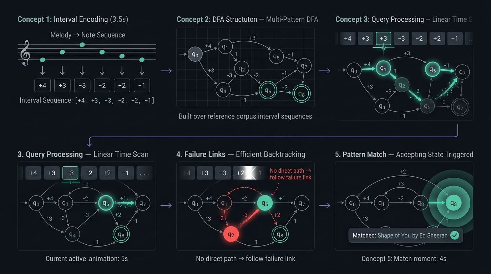
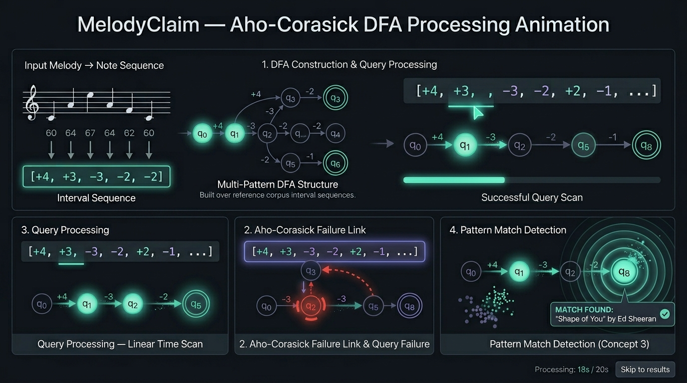

Dark space-themed dashboard (#0a0a0f background) with a 2×3 grid of glassmorphism cards (rgba(255,255,255,0.04) fill, 1px subtle border, soft blur backdrop). Each card owns one pipeline step.
Card 1 — Note Sequence
Horizontally scrollable row of pill-shaped badges, each showing a note name (C4, E4). Active/just-processed badge glows in teal (#00ffcc). Inactive ones are muted grey. Animate left to right as extraction completes.
Card 2 — Interval Encoder
Same pill row as Card 1 but values switch to interval numbers (+3, 0, -2). A visual morph/transition animation plays showing the note badge transforming into its interval badge — makes the encoding step tangible.
Card 3 — Query Processing (DFA Traversal)
Clean horizontal node chain: q18 → q35 → q96 → q0. Each node is a teal-outlined circle. The active node pulses with a glow ring. Interval badges scroll above the chain in sync — the currently processing interval badge highlights as its corresponding state activates. Mismatch events turn the node red briefly before jumping.
Card 4 — Failure Link Handler
Triggered only on mismatch. Shows 3 nodes: the failed state (red), the failure link arrow (dashed red, animated), and the fallback state (orange pulse). A small caption below reads: "Mismatch. Backtracking via failure link to q0." Stays collapsed/greyed out when no mismatch occurs.
Card 5 — Threshold Filter
Matched subsequences appear as green result chips. Short matches (below 7 intervals) visibly fade out with a strikethrough and a Below Threshold red label. Significant matches remain highlighted in teal. Clearly separates noise from real matches.
Card 6 — Pattern Match Detection
Full-width card at the bottom. Matched song name displayed prominently inside a glowing teal ring. Concentric ripple animation on match confirmation. Song name, artist, and match confidence shown in large readable text. View Final Verdict → button in accent purple below.
Typography: Space Grotesk or Inter. Headers in white, captions in #888, values in teal accent. No gradients except on the verdict button. Consistent 16px card padding, 12px gap between cards.

reference images to display all the steps:

